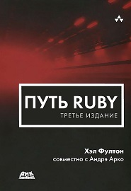

# 100_day_of_ruby
## My Ruby Learn

This is my Challenge about Ruby learn.
Every day I want to spend 1 hour to learn Ruby. 

Вивчаю Ruby за книгою Хела Фултона "Путь Ruby" 3 видання

### [Day 1](https://github.com/CyberGenius1994/100_day_of_ruby/blob/master/day1.rb)
**Введення в ООП.**

**Базовий синтаксис і семантика в Ruby**
* Ключові слова тa ідентифікатори 
* Коментарі
* Константи, змінні та типи

### [Day 2](https://github.com/CyberGenius1994/100_day_of_ruby/blob/master/day2.rb)
**Базовий синтаксис і семантика в Ruby**
* Оператори і пріоритети
* Приклад першої програми [Hello World](https://github.com/CyberGenius1994/100_day_of_ruby/blob/master/Hello_World.rb)
* Цикли й розгалуження

### [Day 3](https://github.com/CyberGenius1994/100_day_of_ruby/blob/master/day3.rb)
**Базовий синтаксис і семантика в Ruby.**

**ООП в Ruby**
* Виключення
* Приклад використання виключень [Exceptions](https://github.com/CyberGenius1994/100_day_of_ruby/blob/master/Exceptions.rb)
* Об'єкти
* Вбудовані класи
* Модулі і класи-домішки

### [Day 4](https://github.com/CyberGenius1994/100_day_of_ruby/blob/master/day4.rb)
**ООП в Ruby**
* Створення класів
* Приклад створення класів [Classes](https://github.com/CyberGenius1994/100_day_of_ruby/blob/master/Classes.rb)

### [Day 5](https://github.com/CyberGenius1994/100_day_of_ruby/blob/master/day5.rb)
**ООП в Ruby**

**Динамічні аспекти Ruby**
* Методи й атрибути
* Приклад створення класів [Methods](https://github.com/CyberGenius1994/100_day_of_ruby/blob/master/Methods.rb)
* Кодування під час виконання
* Приклад написання умов під час виконання [Dynamic_Ruby](https://github.com/CyberGenius1994/100_day_of_ruby/blob/master/Dynamic_Ruby.rb)

### [Day 6](https://github.com/CyberGenius1994/100_day_of_ruby/blob/master/day6.rb)
**Динамічні аспекти Ruby**
* Відображення
* Відсутні методи
* Прибирання сміття

### [Day 7](https://github.com/CyberGenius1994/100_day_of_ruby/blob/master/day7.rb)
**Повторення пройденого**
* Синтаксис

### [Day 8](https://github.com/CyberGenius1994/100_day_of_ruby/blob/master/day8.rb)
**Повторення пройденого**
* Відмінності від інших мов програмування